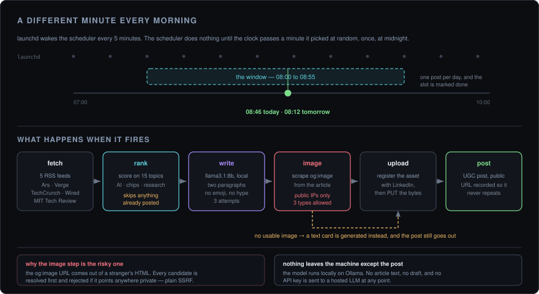

<div align="center">

# linkedin-bot

**Posts one tech story to LinkedIn each morning, at a minute it picks itself.**

Local LLM for the copy, the real article image, and no two posts at the same time on consecutive days.

<p>
  
  
  
  
  
</p>

<br />



<sub>The scheduler wakes every five minutes and almost always does nothing. That's the design.</sub>

</div>

<br />

---

## The short version

Five tech RSS feeds go in. One LinkedIn post comes out, once a day, somewhere between 08:00 and 08:55 — a different minute each morning, so it doesn't read as a cron job.

The copy is written by `llama3.1:8b` running locally through Ollama. The image is the article's own `og:image`, scraped from the source. Nothing about the article, the draft, or your credentials is sent to a hosted model.

---

## What you need first

- [Ollama](https://ollama.com) running, with the model pulled: `ollama pull llama3.1:8b`
- A LinkedIn Developer app with both **Share on LinkedIn** and **Sign In with LinkedIn using OpenID Connect** products added
- Python 3, macOS for the `launchd` scheduling

---

## Setting it up

```zsh
pip3 install -r requirements.txt
```

```zsh
cp .env.template .env      # then add your LinkedIn client ID and secret
```

Authorise once, in a browser:

```zsh
python3 auth.py
```

That opens LinkedIn, takes the approval, and writes `.tokens.json`. Both that file and `.env` are gitignored.

Test it end to end before automating anything:

```zsh
python3 post.py
```

Then install the scheduler:

```zsh
chmod +x setup_launchd.sh && ./setup_launchd.sh
```

That registers two agents: the scheduler every five minutes, and a daily token check at 08:05.

> `cron_setup.sh` is the older approach — a fixed 08:00 and 13:00 via `crontab`. `setup_launchd.sh` supersedes it and removes the agents it replaces. Use the launchd path; cron doesn't survive sleep, which on a laptop means missed mornings.

---

## How the timing works

`launchd` can't schedule "sometime random in a window", so the randomness lives one level up.

The scheduler runs every five minutes and does nothing at all until the clock passes a target minute. That target is chosen once per day, at random, within 08:00–08:55, and stored in `.schedule.json` alongside the date. When the date no longer matches, a fresh time is drawn.

Once a slot fires successfully it's marked `posted`, so the remaining runs that day are no-ops. If `post.py` exits non-zero the slot stays unposted — but it deliberately isn't retried, because the failure modes here (expired token, Ollama down) are ones that repeat, and a retry loop would just multiply the noise.

Running under `launchd` rather than `cron` also means missed runs fire when the Mac wakes, instead of being skipped.

---

## How a post gets made

**Fetch and rank.** Five feeds — Ars Technica, The Verge, TechCrunch, Wired, MIT Technology Review. Each entry is scored on how many of fifteen preferred topics it matches in the title or summary: AI, machine learning, open source, robotics, quantum, semiconductors, research, releases, and so on. Anything whose URL is already in `.posted_urls.json` is skipped, so the same story never goes out twice.

**Write.** The prompt asks for a fixed shape: one paragraph on what happened and why it matters technically, one on the broader implication ending in a question, then hashtags and the source link. It explicitly forbids emoji, first person, and "Excited to share" openers. Three attempts against Ollama with a 90-second timeout; if Ollama isn't running it says so plainly rather than posting something half-formed.

**Image.** The article page is fetched and `og:image`, `twitter:image`, and `og:image:secure_url` are checked in that order. If nothing usable comes back, a text card is generated with Pillow and the post still goes out — a missing image never blocks publishing.

**Upload and post.** LinkedIn wants the asset registered first, then the bytes `PUT` to the URL it hands back, then a UGC post referencing the asset. On success the URL is appended to `.posted_urls.json`.

### The one part that needed a guard

The `og:image` URL comes out of arbitrary third-party HTML — which means a crafted article page could point the bot at `http://localhost:11434` or an address on your LAN, and the bot would dutifully fetch it. Every candidate URL is resolved to an IP first and rejected if it's private, loopback, link-local, reserved, multicast, or unspecified. Content types are limited to JPEG, PNG, and GIF.

It's a small function, and it's the difference between a scraper and an open proxy into your own network.

---

## Keeping it running

LinkedIn access tokens last about 60 days, and there is no way around re-authorising when one expires.

`check_token.py` runs daily at 08:05 and reads the remaining life from `.tokens.json`. At seven days it posts a macOS notification; at one day it escalates; once expired it tells you posts are already failing. Re-authorising is just `python3 auth.py` again.

```zsh
launchctl list | grep linkedinbot     # both agents loaded?
python3 scheduler.py                  # what time is it firing today?
python3 check_token.py                # how long has the token got?
tail -f logs/$(date +%F).log          # today's run, in detail
tail -f logs/launchd.log              # what launchd itself saw
```

Logs are per-day files in `logs/`, which is gitignored.

---

## When it doesn't post

| Symptom | Cause |
|---|---|
| `Ollama is not running` | `ollama serve`, and confirm `llama3.1:8b` is pulled |
| Posts stopped, no errors visible | Token expired. `python3 check_token.py`, then `python3 auth.py` |
| Scheduler runs, nothing fires | Today's slot is already `posted` — check `.schedule.json` |
| `401` from LinkedIn | Token expired, or the app is missing the *Share on LinkedIn* product |
| Every post is text-only | `og:image` scraping is failing or being rejected — the log names the reason |
| Same article twice | `.posted_urls.json` was deleted; it's the only dedup record |

---

## Layout

```
linkedin-bot/
├── post.py             the whole pipeline — fetch, rank, write, image, upload, post
├── scheduler.py        picks a random daily minute, fires post.py once
├── auth.py             one-time OAuth browser flow → .tokens.json
├── check_token.py      daily expiry warning via macOS notification
├── setup_launchd.sh    installs both agents  ← use this
├── cron_setup.sh       superseded fixed-time cron setup
├── .env.template       LinkedIn client ID + secret
└── docs/               the diagram in this README
```

Untracked by design: `.env`, `.tokens.json`, `.posted_urls.json`, `.schedule.json`, `logs/`.

---

## Tuning it

Everything worth changing is a constant near the top of one file.

| What | Where |
|---|---|
| Which feeds | `RSS_FEEDS` in `post.py` |
| What counts as interesting | `PREFERRED_TOPICS` in `post.py` |
| Tone, length, structure | the prompt in `generate_post()` |
| The model | the `"model"` field in the Ollama request |
| Posting window, or adding more | `WINDOWS` in `scheduler.py` — it's a list of tuples, and a second entry gives you a second post |
